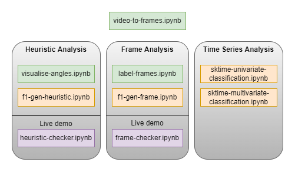

# Virtual Personal Trainer
A collection of notebooks for my final year project. The notebooks are used to create a virtual personal trainer to check bicep curls, squats and overhead presses.

All notebooks in this project are self-contained and documented.

## Exmaples

Live demo of bicep curl repeition counter in /bicep-curl-phases.

Live demo of bicep curl form checker in /bicep-curl-checker.

## Approaches
### 1. Geometric/Heuristic Evaluation

Live demo for heuristic model is heuritic-checker.ipynb in each folder.

### 2. Frame Evaluation

Live demo for heuristic model is frame-checker.ipynb in each folder.

### 3. Time Series Evaluation

No live demo for time series.

The dataset used to train and evaluate the approaches contains 311 videos of incorrect and correct form for the exercises. The output of the HPE library on every video in the dataset is provided in a .dump file for each exercise.

## Code Organisation

## Technologies Used
* Jupyter Notebooks with Python
* [Sktime](https://github.com/alan-turing-institute/sktime)
* [Sci-kit Learn](https://github.com/scikit-learn/scikit-learn)
* [BlazePose](https://github.com/vietanhdev/tf-blazepose)
* [OpenCV](https://github.com/opencv/opencv)
